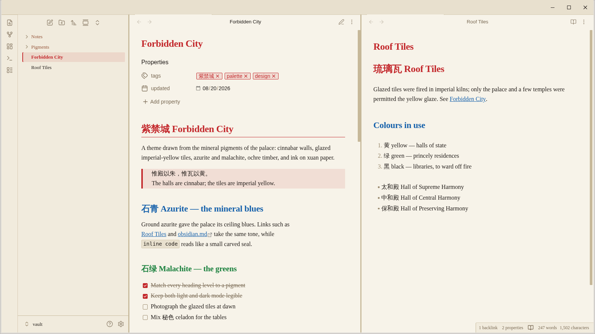
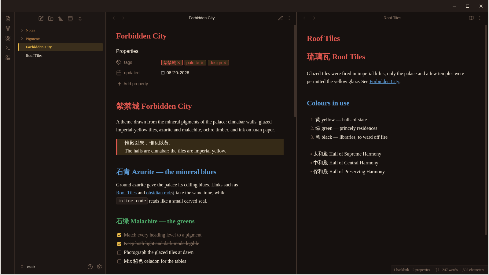
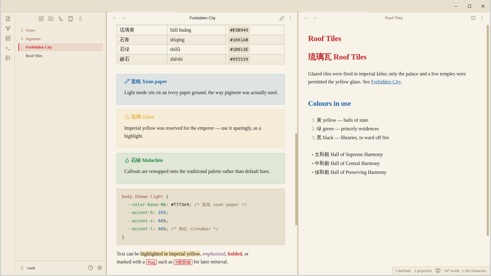
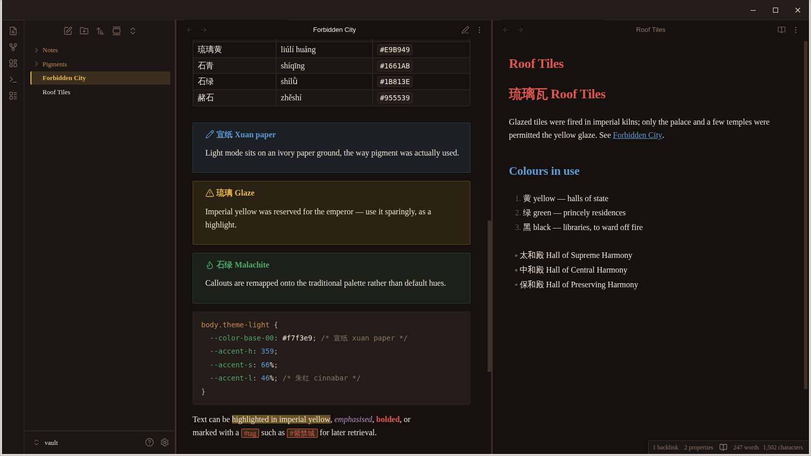

# Forbidden City 紫禁城

An Obsidian theme built from traditional Chinese colours: cinnabar palace walls,
glazed imperial-yellow roof tiles, azurite and malachite mineral pigments, ochre
timber, and ink on xuan paper. Light mode sits on a warm paper ground, dark mode
on ink.

## Screenshots

Light mode — 宣纸 xuan paper:



Dark mode — 墨夜 ink night:



Callouts, tables, and code, with the palette mapped onto Obsidian's semantic colours:





Screenshots captured in Obsidian 1.13.7.

## Palette

| Colour | Pinyin / gloss | Light | Dark |
| --- | --- | --- | --- |
| 朱红 | zhūhóng, cinnabar (palace walls) | `#C3272B` | `#E0574F` |
| 胭脂 | yānzhī, rouge | `#9D2933` | `#D46A70` |
| 琉璃黄 | liúlí huáng, glazed imperial yellow | `#E9B949` | `#E9B949` |
| 赭石 | zhěshí, ochre | `#955539` | `#C98A4B` |
| 石青 | shíqīng, azurite | `#1661AB` | `#5C9BD6` |
| 靛青 | diànqīng, indigo | `#2E4E7E` | `#7897C2` |
| 石绿 | shílǜ, malachite | `#1B813E` | `#4FA96A` |
| 秘色 | mìsè, celadon | `#7FB3A0` | `#6FB8AE` |
| 藕荷 | ǒuhé, lotus-root mauve | `#B57D9C` | `#B58BC2` |
| 宣纸 | xuānzhǐ, paper ivory | `#F7F3E9` | — |
| 墨 | mò, ink | — | `#16110F` |

Cinnabar is the accent in light mode and imperial yellow in dark mode. Headings
step through the pigments (H1 cinnabar, H2 azurite, H3 malachite, H4 ochre), tags
read as small vermilion seal chips, and callouts are remapped onto the same
palette.

Reading text uses a CJK-friendly serif stack (Songti SC, Noto Serif CJK SC,
Source Han Serif SC, SimSun, Georgia); the interface uses PingFang SC / Noto Sans
CJK SC. No fonts are bundled or fetched remotely.

## Installation

Once published, install **Forbidden City** from Obsidian's community themes
directory:

1. Open **Settings → Appearance → Community themes**.
2. Search for **Forbidden City** and select **Install**.
3. Select **Use**.

For manual installation, copy `manifest.json` and `theme.css` into:

```text
<vault>/.obsidian/themes/Forbidden City/
```

Then select **Forbidden City** under **Settings → Appearance → Themes**.

Obsidian 1.13 or later is required: the theme uses the colour-valued
`--callout-color` introduced in 1.13, which replaced the older RGB-triplet form.

## Development

Based on [obsidian-sample-theme](https://github.com/obsidianmd/obsidian-sample-theme).
All styling lives in `theme.css` and is expressed through Obsidian's CSS
variables.

```bash
npm install
npm run lint
```
